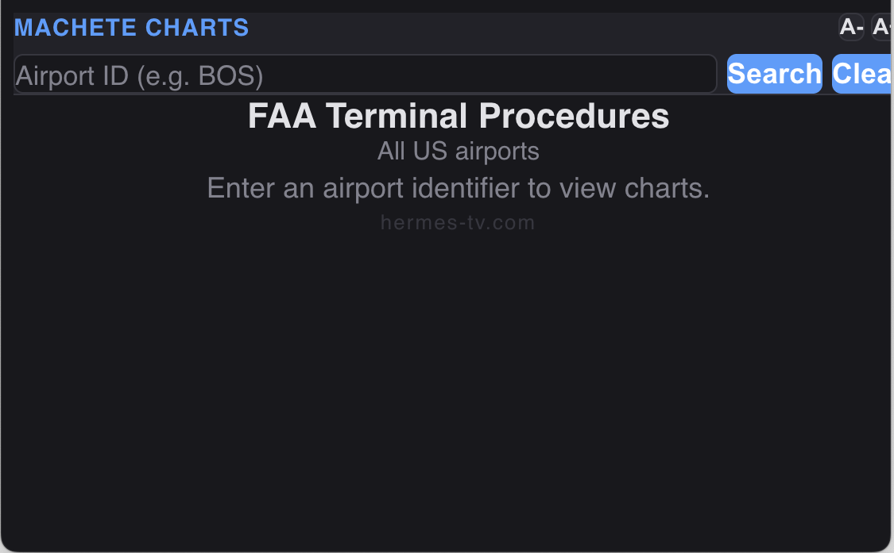

# Machete Charts

Free FAA terminal procedure charts inside Microsoft Flight Simulator. View airport diagrams, instrument approaches, SIDs, and STARs without leaving the cockpit.



## What It Does

Machete Charts adds an in-game panel to MSFS that lets you search and view FAA chart plates for **3,193 US airports** — the same charts published in the FAA's digital Terminal Procedures Publication (d-TPP).

- **Airport Diagrams** — Taxi layouts for towered and non-towered airports
- **Instrument Approaches** — ILS, RNAV, VOR, LOC, and visual approaches
- **Departures (SIDs)** — Standard instrument departure procedures
- **STARs** — Standard terminal arrival routes

Charts are updated every 28 days to match the FAA's AIRAC cycle.

## Features

- Search by FAA identifier (e.g. `BOS`, `JFK`, `LAX`) or airport name
- Autocomplete suggestions as you type
- ICAO K-prefix handled automatically (`KBOS` finds `BOS`)
- Pan and zoom on chart plates (mouse drag, scroll wheel, pinch)
- Double-click to zoom in on a specific area
- On-screen keyboard for VR users
- Adjustable text size (A-/A+) for VR readability
- Recently viewed airports for quick access
- Works in both 2D and VR

## Installation

### Windows Installer

Download `MacheteChartsSetup.exe` from the [latest release](https://github.com/tmhoule/MacheteCharts/releases) and run it. The installer auto-detects your MSFS Community folder.

### Manual Install

1. Download or clone this repo
2. Copy the `machete-charts` folder into your MSFS Community folder:
   - **MS Store:** `%LOCALAPPDATA%\Packages\Microsoft.FlightSimulator_8wekyb3d8bbwe\LocalCache\Packages\Community\`
   - **Steam:** `%APPDATA%\Microsoft Flight Simulator\Packages\Community\`
3. Restart MSFS

### PowerShell Install

```powershell
powershell -ExecutionPolicy Bypass -File installer\install.ps1
```

Or double-click `installer\install.bat`.

## Usage

1. In MSFS, open the toolbar at the top of the screen
2. Click the **Machete Charts** icon to open the panel
3. Type an airport identifier and select from the suggestions, or click **Search**
4. Choose a chart category (Diagram, Approaches, Departures, STARs)
5. Select a plate to view it
6. Zoom with scroll wheel or +/- buttons, pan by dragging, double-click to zoom in
7. Click **Fit** to reset the view
8. Click **Clear** to return to the search screen

### VR Tips

- Tap the search input to bring up the on-screen keyboard
- Use the **^** and **v** keys to scroll through search suggestions, **Go** to select
- Use **A-** / **A+** to adjust text size — it goes up to 300%
- Your text size preference is saved between sessions

## Chart Updates

Charts follow the FAA's 28-day AIRAC cycle. To update:

```bash
./scripts/update-faa-charts.sh
```

This downloads the latest d-TPP charts from the FAA, converts them, and uploads to the chart server. Run it within a few days of each new cycle effective date.

## Uninstall

Run `installer\uninstall.ps1` or delete the `machete-charts` folder from your MSFS Community folder.

## Requirements

- Microsoft Flight Simulator 2020 (v1.19.8+) or 2024
- Internet connection (charts are loaded from the server)

## Credits

Built by [hermes-tv.com](https://hermes-tv.com). Chart data sourced from the FAA's freely available digital Terminal Procedures Publication.

## License

This project is provided as-is for flight simulation use. FAA charts are public domain.
